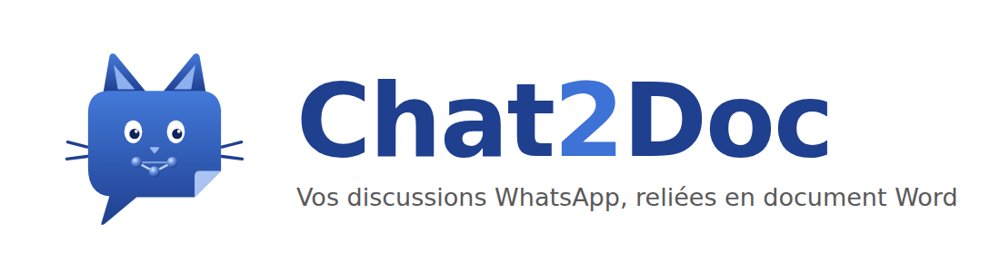
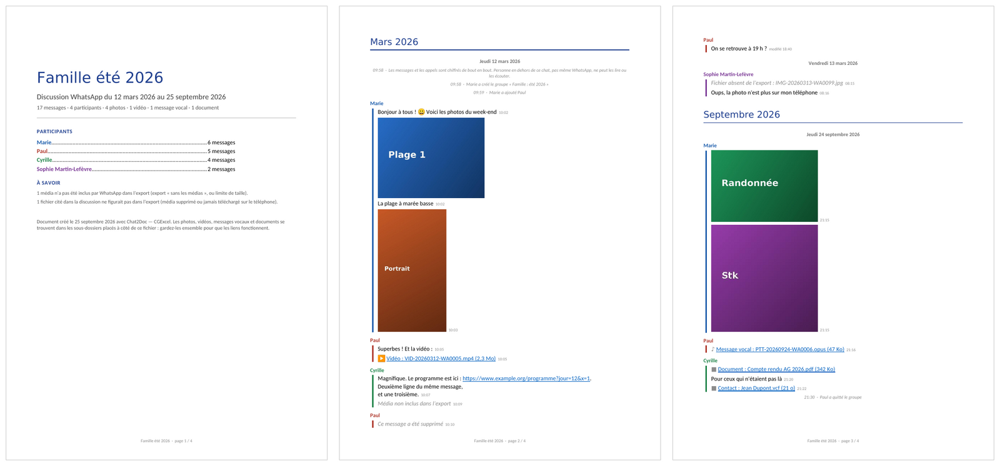

<p align="center">
  
</p>

# Chat2Doc

**Chat2Doc** transforme une discussion WhatsApp exportée en **document Word** mis en page,
accompagné de tous ses médias rangés dans des sous-dossiers : de quoi conserver, imprimer ou
transmettre l'histoire d'un groupe familial, d'une association ou d'un chantier.

Application Android, libre et gratuite, sans publicité : tout le traitement se fait sur le
téléphone, et rien de vos discussions n'est envoyé sur Internet.

<p align="center">
  
</p>

## Ce que produit Chat2Doc

Une archive `.zip` qui contient :

```
Famille été 2026/
├── Famille été 2026 - 2025.docx  ← la discussion mise en page, un document par année
├── Famille été 2026 - 2026.docx
├── Photos/                    ← photos et autocollants, en taille d'origine
├── Videos/
├── Audio/                     ← messages vocaux et fichiers audio
├── Documents/                 ← PDF, Word, Excel…
├── Contacts/                  ← cartes de visite (.vcf)
└── Texte original/            ← les fichiers texte bruts fournis par WhatsApp
```

Le document Word comporte :

- une **page de garde** : nom de la discussion, période couverte, nombre de messages, de photos,
  de vidéos…, et la liste des participants avec leur nombre de messages ;
- un **titre par mois et par jour**, qui alimente le volet de navigation de Word
  (*Affichage → Volet de navigation*) : on retrouve une date en un clic, même sur des années
  d'échanges ;
- une **couleur par participant** et l'heure de chaque message, comme dans WhatsApp ;
- les **photos insérées dans le fil**, à leur place ; un clic sur une photo ouvre l'original ;
- des **liens** vers les vidéos, messages vocaux et documents, qui s'ouvrent depuis le document ;
- les adresses web rendues cliquables et, si vous le souhaitez, **l'aperçu des liens** comme dans
  WhatsApp : vignette, titre et nom du site (ou titre et chaîne pour une vidéo YouTube) ;
- les messages supprimés ou modifiés signalés, et les médias manquants indiqués.

> Gardez le document Word **dans son dossier**, à côté des sous-dossiers : les liens sont relatifs.
> On peut déplacer ou copier le dossier entier (clé USB, disque, Drive…) sans rien casser.

## Utilisation

1. Dans WhatsApp, ouvrez la discussion à conserver.
2. Menu **⋮ → Plus → Exporter la discussion → Joindre les médias**.
3. Dans la liste des applications, choisissez **Chat2Doc**.
4. Une fois la conversion terminée : **Enregistrer l'archive…** (dans Téléchargements, sur Drive…),
   **Partager**, ou **Ouvrir le document Word** directement sur le téléphone.

On peut aussi lancer Chat2Doc et choisir un export `.zip` déjà enregistré.

### Dossier Chat2Doc : un historique qui se complète

Sur l'écran d'accueil, **Dossier Chat2Doc → Choisir le dossier…** permet de désigner un dossier du
téléphone (par exemple `Documents/Chat2Doc`). Chaque discussion y a alors son propre dossier — le
document Word et les sous-dossiers de médias — **complété à chaque nouvel export** :

- les messages déjà connus ne sont pas dupliqués, les nouveaux s'ajoutent, les nouveaux médias
  rejoignent les sous-dossiers ;
- les photos déjà réduites et les aperçus de liens déjà obtenus sont réutilisés : une mise à jour
  est beaucoup plus rapide qu'une première conversion ;
- en exportant régulièrement (avant que les messages ne sortent de la fenêtre des ~10 000 derniers
  messages exportés par WhatsApp), on conserve **l'historique complet, photos comprises**, sans
  limite.

L'écran d'accueil liste les **discussions enregistrées**, avec la période couverte, le nombre de
messages et la date de la dernière mise à jour ; toucher une discussion ouvre son document Word.

Chaque dossier de discussion contient aussi un sous-dossier caché `.chat2doc` (index des médias,
photos réduites, aperçus des liens, textes des exports) : à conserver avec le reste.

### Fusion d'exports (discussions très longues)

WhatsApp limite l'export à environ 10 000 messages avec médias et 40 000 sans. Pour une longue
discussion, exportez-la **sans les médias** puis **avec les médias**, et partagez les deux avec
Chat2Doc : les messages anciens (sans photos) et récents (avec photos) sont réunis dans un seul
document. Sans dossier Chat2Doc, l'appli propose cette fusion quand deux exports de la même
discussion se suivent. Elle signale aussi un export qui semble tronqué par WhatsApp.

### Un document Word par année

Par défaut, Chat2Doc écrit **un document par année** (`Famille - 2025.docx`, `Famille - 2026.docx`…) :
des fichiers plus légers, plus rapides à ouvrir, surtout sur téléphone. Chaque document a sa page
de garde et cite les autres années. Avec un dossier Chat2Doc, seul le document de l'année qui a
changé est réécrit lors d'une mise à jour. La case *Un document Word par année* permet de revenir
à un document unique.

### Réactions (émojis sous les messages)

WhatsApp n'inclut pas les réactions (👍, ❤️… ajoutés sous un message) dans ses exports : elles ne
peuvent donc pas apparaître dans le document. Les émojis écrits dans le texte des messages sont,
eux, bien conservés.

### Aperçus des liens

WhatsApp n'inclut pas les aperçus des liens dans l'export : le fichier texte ne contient que les
adresses. Si la discussion contient des liens, Chat2Doc indique leur nombre et une **estimation de
la durée** nécessaire, puis propose d'aller chercher les aperçus sur Internet (titre, image, nom du
site). On peut refuser, ou en cours de route toucher **« Ignorer les aperçus restants »** : la
conversion se poursuit avec les aperçus déjà obtenus. Les liens restent cliquables dans tous les cas.

Le réglage *Photos dans le document Word* fixe la taille des photos insérées dans le document
(800 px, 1280 px ou taille d'origine) ; les originaux sont de toute façon conservés dans le
dossier `Photos`.

### Formats reconnus

- exports Android et iPhone ;
- WhatsApp réglé en français, anglais, espagnol, allemand, italien, portugais ou néerlandais ;
- dates jour/mois ou mois/jour : l'ordre est déduit de l'ensemble du fichier.

### Limites

- WhatsApp limite lui-même l'export avec médias à environ **10 000 messages récents**
  (40 000 sans les médias). Pour les groupes très anciens, le début de la discussion peut manquer.
- Seuls les médias encore présents sur le téléphone qui exporte sont inclus. Les fichiers cités mais
  absents sont signalés dans le document.
- Chat2Doc ne peut pas lire directement les conversations de WhatsApp : Android l'interdit, et
  c'est très bien ainsi. Il part toujours de l'export officiel.

## Installation

Chat2Doc n'est pas (encore) sur le Play Store. Pour l'installer :

1. Téléchargez le fichier `Chat2Doc-x.y-….apk` depuis la page
   [**Releases**](../../releases) du dépôt (ou, pour la toute dernière version de travail, depuis
   l'onglet [**Actions**](../../actions) → dernière exécution réussie → *Artifacts*).
2. Ouvrez-le sur le téléphone ; Android demande d'autoriser l'installation d'applications depuis
   cette source (navigateur ou gestionnaire de fichiers) : acceptez pour cette fois.

Android 8.0 ou plus récent.

## Compilation

Le projet s'ouvre tel quel dans **Android Studio** (*File → Open*, dossier du dépôt).

En ligne de commande (JDK 17 et SDK Android installés) :

```bash
./gradlew testDebugUnitTest   # tests du moteur de conversion
./gradlew assembleDebug       # APK dans app/build/outputs/apk/debug/
```

Sur GitHub, chaque envoi déclenche la construction automatique (fichier
`.github/workflows/build.yml`) ; chaque étiquette `v1.0`, `v1.1`… publie une *Release* avec l'APK.

### Version signée pour le Play Store

Les APK « debug » sont signés avec une clé de test commune, versionnée dans le dépôt, pour que
chaque nouvelle version s'installe par-dessus la précédente. Pour une publication, créez votre
propre clé **et ne la versionnez jamais** :

```bash
keytool -genkeypair -v -keystore chat2doc-release.jks -alias chat2doc \
        -keyalg RSA -keysize 2048 -validity 10000
base64 -w0 chat2doc-release.jks > cle.txt
```

puis, dans *Settings → Secrets and variables → Actions* du dépôt, créez les secrets
`CHAT2DOC_KEYSTORE_BASE64` (contenu de `cle.txt`), `CHAT2DOC_KEYSTORE_PASSWORD`,
`CHAT2DOC_KEY_ALIAS` et `CHAT2DOC_KEY_PASSWORD`. Le workflow produira alors aussi l'APK
« release » signé.

### Organisation du code

| Dossier | Rôle |
|---|---|
| `app/src/main/java/fr/cgexcel/chat2doc/core/` | Moteur de conversion en Java pur, sans dépendance à Android : analyse de l'export (`ChatParser`), rangement des médias et archive (`Converter`, `Zips`), écriture du document Word au format Office Open XML (`DocxWriter`). |
| `app/src/main/java/fr/cgexcel/chat2doc/` | Application Android : réception du partage, interface, préparation des photos (`AndroidImageProcessor`). |
| `app/src/test/` | Tests unitaires du moteur. |
| `docs/logo/` | Logo (SVG et PNG) et bannière. |

Le document Word est écrit directement, sans bibliothèque externe : l'application reste légère
et ne demande aucune permission.

## Confidentialité

Chat2Doc n'accède ni aux contacts ni au stockage : les fichiers lui sont confiés par le menu de
partage et repartent par le sélecteur de fichiers d'Android. Sa seule permission est l'accès à
Internet, utilisé **uniquement** pour les aperçus des liens, et seulement si vous l'acceptez : il
consulte alors les pages concernées, comme le ferait un navigateur, sans rien envoyer de vos
discussions. Rien ne quitte le téléphone sans votre action.

Chat2Doc n'est ni affilié à WhatsApp ni approuvé par WhatsApp ou Meta. WhatsApp est une marque de
WhatsApp LLC.

## Licence

Ce logiciel est publié sous [licence MIT](LICENSE) : utilisation, copie, modification et
redistribution libres, y compris en usage professionnel.

Il est accompagné de la **BAL 1.0 — [Bonne Action License](BAL.md)** : un vœu sur l'honneur, et non
une condition juridique. Vous êtes simplement invité à **faire une bonne action chaque jour**. Ne
pas le faire ne vous retire aucun droit.

© 2026 Cyrille — CGExcel
